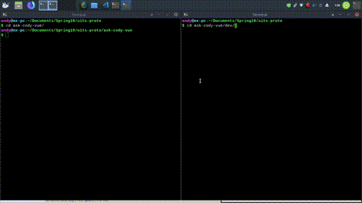
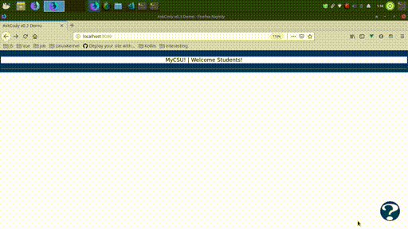

# AskCody v0.4


## Table Of Contents
1. [Foreword](#foreword)
2. [Prerequisites](#prereqs)
3. [Getting Started](#getstart)
    * [Quick Note](#getstart-note)
        * [Theming](#note-themes)
        * [Getting The Code](#note-code)
    * [Running The Code](#runcode)
        * [Ask-Cody-Ember](#runcode-ember)
        * [Ask-Cody-Vue](#runcode-vue)
0. [What To Read Next](#readnext)

<a type="hidden" id="foreword"></a>

## Foreword
***
### Team 0

*AskCody* was an existing in-production chatbot for frequently asked questions that UITS encounters. However, AskCody did not in its starting state have an existing interactive interface (aside from the one provided by its DialogFlow base). We were charged with creating a means to interact with the DialogFlow base of the project including chatting with it, providing feedback, and fitting into a more uniform myCSU experience. To accomplish this we first developed [Ask-Cody-Ember] in our  architectural spike. We found out in the next cycle that Ember.js had deprecated, but yet to implement, several key features we would find necessary. As such, we switched to Vue.js and developed the [Ask-Cody-Vue] frontend.

<a type="hidden" id="prereqs"></a>

## Prerequisites
***
This project uses Vue.js web framework and Node along with the Axios library.

* [Node.js and npm]  
  As an asynchronous event driven JavaScript runtime, Node is designed to build scalable network applications. 
* [Vue.js]  
  Vue.js is a progressive, incrementally-adoptable JavaScript framework for building UI on the web. 
* [vue-beautiful-chat]  
  A simple and beautiful Vue chat component backend agnostic, fully customisable and extendable.
* [yarn](https://yarnpkg.com/en/)  
package manager for your code
* [git for Windows] (https://gitforwindows.org/)
  While not a necessity, git for Windows provides a helpful BASH emulator for Windows-based users to execute git commands.

<a id="getstart" type="hidden"></a>

## Getting Started
***
<a type="hidden" id="getstart-note"></a>

### Quick Note From Team 0
<a type="hidden" id="note-themes"></a>

* __*At the time*__ of writing this, the CreateYou branding had just launched.
    * The color theme is created from the following colors:
        * Primary Colors
            1. Columbus State Blue: #003767, rgb(25,57,102)
            2. Columbus State Red: #e31837, rgb(227, 24, 55)
        * Secondary Colors
            1. Columbus State Purple: # , rgb()
            2. Columbus State Green: # , rgb()
            3. Columbus State Orange: # , rgb()

<a type="hidden" id="note-code"></a>

1. Get a copy of the Source
    * Currently available through: `https://github.com/adlesh/uits-proto`
    * Using git: `git clone https://github.com/adlesh/uits-proto.git`
2. [Ask-Cody-Ember] is a good place to start for those a bit less web-dev experienced
    * Utilizes [Pusher.js] to emulate the eventual hosting of The Ask-Cody suite on CSU servers
    * Uses [iframe-resizer] to ensure that Ask-Cody is loaded in correctly
3. [Ask-Cody-Vue] is the current implementation and is a tad more complicated
    * Uses the [vue-beautiful-chat] package found here to create an intercom-like chat service
4. Getting Dependencies
    * The node_modules directory is ignore by git to reduce download and upload times and must be generated
    * Ask-Cody-Ember uses npm to manage packages, so run: `npm install`
    * Ask-Cody-Vue uses yarn to manage packages, so run:
        ```bash
        cd ask-cody-vue
        yarn
        cd ask-cody-vue/dev
        yarn
        ```


<a type="hidden" id="runcode"></a>


### Running The Code
***

 __*Start* here__ for either: Open the root directory, currently referred to as: [uits-proto]

<a type="hidden" id="runcode-vue"></a>

### Ask-Cody-Vue

1. Build the code for development  

    * yarn watch allows hot-editing
    * yarn dev builds the actual code for the site 

<a type="hidden" id="feedback"></a>

2. Launching Feedback Form from Ask-Cody-Vue panel


<a type="hidden" id="runcode-ember"></a>

### Ask-Cody-Ember
* __Make sure to set up a .env file _before_ running__
    ```bash
    PUSHER_APP_ID="Pusher Dashboard > Select your app > select App Keys > COPY APP_ID OVER ALL OF THE TEXT IN THESE QUOTES"  
    PUSHER_APP_KEY="dcf5aa164Pusher Dashboard > Select your app > select App Keys > COPY KEY OVER ALL OF THE TEXT IN THESE QUOTES"
    PUSHER_APP_SECRET="Pusher Dashboard > Select your app > select App Keys > COPY SECRET OVER ALL OF THE TEXT IN THESE QUOTES"
    PUSHER_APP_CLUSTER="Pusher Dashboard > Select your app > select App Keys > COPY CLUSTER OVER ALL OF THE TEXT IN THESE QUOTES"

    DEVELOPER_ACCESS_TOKEN="DialogFlow Dashboard > Select your bot > Click Gear > COPY API KEYS (V1) - DEVELOPER ACCESS TOKEN OVER ALL OF THE TEXT IN THESE QUOTES"
    ```
* Launch the message server:  
    `node app.js`
* Launch the web app:  
    `ember serve`
* Visit the base app at [http://localhost:4200](http://localhost:4200)
* Open `cody-iframe.html` to see an early implementation of the AskCody wrapper project


<a type="hidden" id="readnext"></a>

### What To Read Next
***
Catch up on everything VueJS-based: [Ask-Cody-Vue]  
Read About Our *Old* EmberKs implementation: [Ask-Cody-Ember]


[//]: # (These are a list of re-usable links throughout this README)
[Ask-Cody-Vue]: docs/ask-cody-vue.md
[Ask-Cody-Ember]: docs/ask-cody-ember.md
[Node.js and npm]: https://nodejs.org/
[Vue.js]: https://vuejs.org/
[vue-beautiful-chat]: https://vuejsexamples.com/a-simple-and-beautiful-vue-chat-component-backend-agnostic/
[yarn]: https://yarnpkg.com/en/
[Pusher.js]: https://github.com/pusher/pusher-js
[iframe-resizer]: https://github.com/davidjbradshaw/iframe-resizer
[uits-proto]: https://www/github.com/adlesh/uits-proto