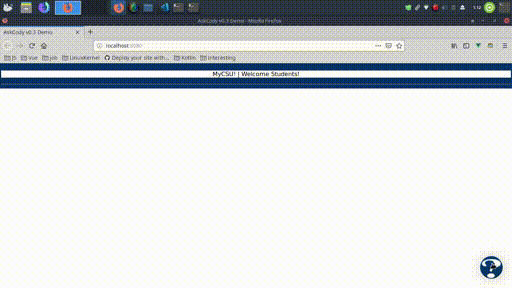

# AskCody v0.4



## Table Of Contents
1. [Foreword](#foreword)
2. [Prerequisites](#prereqs)
    * [What you'll need](#must-install)
    * [Whay you might want](#might-install)
    * [Helpful links](#helpful-links)
3. [Getting Started](#getstart)
    * [Quick Note](#getstart-note)
        * [Theming](#note-themes)
        * [Getting The Code](#note-code)
    * [Running The Code](#runcode)
        * [Ask-Cody-Vue](#runcode-vue)
0. [What To Read Next](#readnext)

<a type="hidden" id="foreword"></a>

## Foreword
***
### Team 0

*AskCody* was an existing in-production chatbot for frequently asked questions that UITS encounters. However, AskCody did not in its starting state have an existing interactive interface (aside from the one provided by its DialogFlow base). We were charged with creating a means to interact with the DialogFlow base of the project including chatting with it, providing feedback, and fitting into a more uniform myCSU experience. To accomplish this we first developed [Ask-Cody-Ember] in our  architectural spike. We found out in the next cycle that Ember.js had deprecated, but yet to implement, several key features we would find necessary. As such, we switched to Vue.js and developed the [Ask-Cody-Vue] frontend.

<a type="hidden" id="prereqs"></a>

## Prerequisites
***
This project uses Vue.js web framework and Node along with the Axios library.

<a type="hidden" id="must-install"></a>
### For the current project implementation you will need to install:
* [Node.js](https://nodejs.org/en/) with [npm](https://www.npmjs.com/)  
  As an asynchronous event driven JavaScript runtime, Node is designed to build scalable network applications. If you've installed NodeJs, you probably already have npm. To verify, you can run `node -v` and `npm -v` in your terminal.
* [yarn](https://yarnpkg.com/en/)  
  Package manager for your code. We use this to install all dependencies for the site. You can get your platform-specific installation instructions on the [yarn install page](https://yarnpkg.com/lang/en/docs/install/).

Additionally, make sure that you are using an operating system with access to a unix command line shell which will be capable of using git and yarn. This is easiest achieved on Linux and MacOS, but can be done on Windows as well. Using [Cygwin](https://www.cygwin.com/) is a great way to make sure that everything installs correctly.

<a type="hidden" id="might-install"></a>
### Useful package managers for ease of install
We all like making the installation process easier for ourselves. Here are some package managers you can use to install all of your dependencies (such as Node and Yarn) quickly and easily. None of these are required but they will make things easier for you.
* [git for Windows](https://gitforwindows.org/)  
  Git for Windows provides a helpful BASH emulator for Windows-based users to execute git commands. If you're planning on running the code in Windows, this will help.
* [Chocolatey for Windows](https://chocolatey.org/)  
  Similar to Brew for MacOS, Chocolatey provides an easy way to install dependencies without using an installer or npm. You can use the commands `choco install yarn` and `choco install nodejs` to get everything you need to begin.
* [Homebrew for MacOS](https://brew.sh/)  
  Homebrew is a fantastic project that installs a whole lot of tools a developer needs for MacOS. Typically a brew install includes nodejs automatically but you can also install it manually with `brew install node`. You can get yarn with `brew install yarn`. There's brew options for linux flavors as well!

<a type="hidden" id="helpful-links"></a>
### For information on the project's libraries and troubleshooting you can check:
* [Vue.js]  
  Vue.js is a progressive, incrementally-adoptable JavaScript framework for building UI on the web.
* [vue-beautiful-chat]  
  A simple and beautiful Vue chat component backend agnostic, fully customisable and extendable.

<a id="getstart" type="hidden"></a>

## Getting Started
***
<a type="hidden" id="getstart-note"></a>

### Quick Note From Team 0
<a type="hidden" id="note-themes"></a>

* __*At the time*__ of writing this, the CreateYou branding had just launched.
    * The color theme is created from the following colors:
        * Primary Colors
            1. Columbus State Blue: #003767, rgb(25,57,102)
            2. Columbus State Red: #e31837, rgb(227, 24, 55)
        * Secondary Colors
            1. Columbus State Purple: #6f1d46, rgb(111,29,70)
            2. Columbus State Green: #b19800, rgb(177,152,0)
            3. Columbus State Orange: #e17d00, rgb(225,125,0)

<a type="hidden" id="note-code"></a>
### Getting and installing the source code
1. Get a copy of the source code
    * Currently available through: `https://github.com/adlesh/uits-proto`
    * Using git: `git clone https://github.com/adlesh/uits-proto.git`
2. [Ask-Cody-Vue] is the current implementation and requires node and yarn. Make sure you have everything you need to run the code before moving on.
    * Uses the [vue-beautiful-chat] package found here to create an intercom-like chat service
    * If you don't have all the dependencies [from above](#must-install) (Node and Yarn) then you will want to get them at this step!
    * Check to see if you have node and yarn with the following commands:
      ```bash
      node -v
      yarn -v
      ```
3. Getting Dependencies
    * The node_modules directory is ignored by git to reduce download and upload times and must be generated
    * Ask-Cody-Vue uses yarn to manage packages, so the terminal commands you want to run are:
        ```bash
        cd ask-cody-vue
        yarn
        cd ask-cody-vue/dev
        yarn
        ```
The `yarn` process may take a moment but when it's done, you should have all the packages you need to run the chatbot site! You can then move on to [running the project](#runcode).

<a type="hidden" id="runcode"></a>


### Running The Project
***

 __Make sure you have [yarn](https://yarnpkg.com/lang/en/docs/install/) before continuing. Follow the directions in Step 3 from above to make sure the code is installed.__

<a type="hidden" id="runcode-vue"></a>

### Launching Ask-Cody-Vue

1. Build the code for development  

    * If you are making edits to the chat window and want live updates, you use the `yarn watch` command. From the root directory:
    ```bash
    cd ask-cody-vue/
    yarn watch
    ```
    * If this is your first time running the code, you want to *always* run `yarn watch` first before continuing to compile some dependencies. The site will not be ready without it!
    * To actually launch the site, you want to navigate to the /dev/ folder and use `yarn dev`. From the root directory:
    ```bash
    cd ask-cody-vue/dev
    yarn dev
    ```
    * Run the above script in a new terminal instance (new tab or window) so that you're running `yarn watch` and `yarn dev` concurrently.
    * The site will launch on localhost:4200/ unless you've specified something different. Now you can interact with the chat window!
    * With both `watch` and `dev` running correctly, you should be able to see any edits you make to the site as you go.


<a type="hidden" id="readnext"></a>

### What To Read Next
***
Catch up on everything VueJS-based: [Ask-Cody-Vue]  
Read About Our *Old* EmberJs implementation: [Ask-Cody-Ember]


[//]: # (These are a list of re-usable links throughout this README)
[Ask-Cody-Vue]: docs/ask-cody-vue.md
[Ask-Cody-Ember]: docs/ask-cody-ember.md
[Node.js and npm]: https://nodejs.org/
[Vue.js]: https://vuejs.org/
[vue-beautiful-chat]: https://vuejsexamples.com/a-simple-and-beautiful-vue-chat-component-backend-agnostic/
[yarn]: https://yarnpkg.com/en/
[Pusher.js]: https://github.com/pusher/pusher-js
[iframe-resizer]: https://github.com/davidjbradshaw/iframe-resizer
[uits-proto]: https://www/github.com/adlesh/uits-proto
